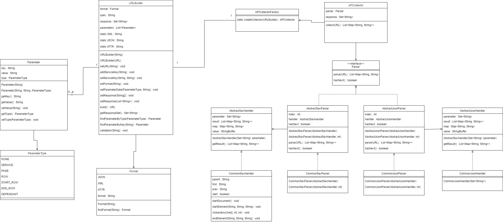

# API COLLECTOR 프로젝트
실무에서 개발한 API를 정리 및 기록하기 위한 프로젝트로 
JSON/XML로 제공되는 API의 데이터를 수집하여 Object 데이터로 변환하는 수집 자동화 API입니다.
###### 실무에 적용된 API와 동일하지 않으며 개발했던 경험을 기반으로 완전 리팩토링하여 개발했습니다. 
*****

</img>

```
URLBuilder urlBuilder = new URLBuilder("https://portal.nrich.go.kr/kor/openapi.do?idx=8&firstindex=xx&recordcountperpage=xx");
urlBuilder.setFormat(URLBuilder.XML);
urlBuilder.setParameterData(ParameterType.PAGE, "1");
urlBuilder.setParameterData(ParameterType.ROW, "100");

URL url = urlBuilder.build();
APICollector collector = APICollectorFactory.createCollector(urlBuilder);
List<Map<String, String>> collect = collector.collect(urlBuilder.build());
System.out.println(collect);

```